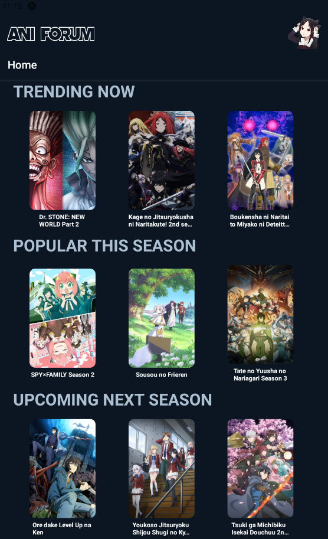
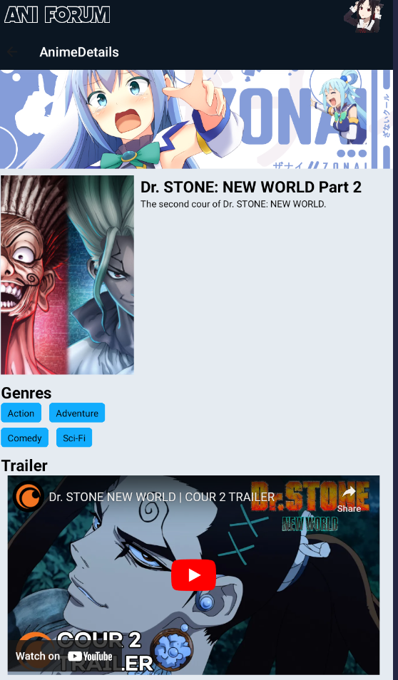
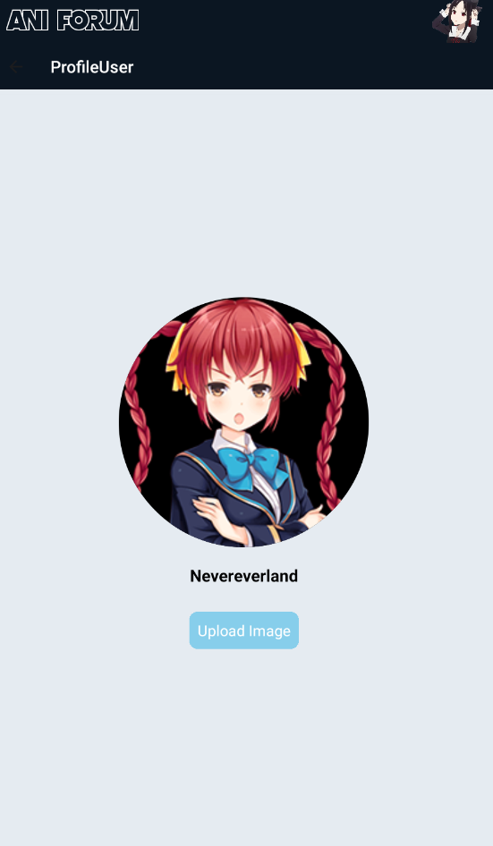
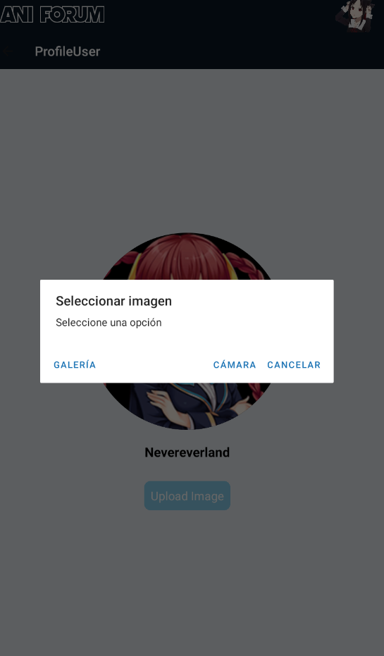
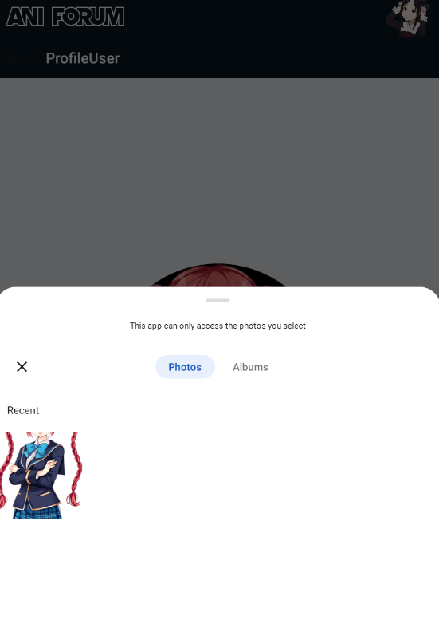

[](https://classroom.github.com/a/lkExPRSj)
# Laboratorio 05: Introducción a desarrollo mobile

## Instrucciones :page_facing_up:

- Individual
- Tiempo 120 minutos

## Objetivos :dart:

- Familiarizarse con `React Native` y `Expo`.
- Consumir un `API` externa.
- Identificar los casos de uso de un sistema.

## Instrucciones :mega:
### Prerrequisitos

Antes de comenzar este laboratorio, asegúrate de tener instalados los siguientes componentes en tu sistema:

- [Node.js](https://nodejs.org/) (versión LTS recomendada)
- [npm](https://www.npmjs.com/) o [Yarn](https://yarnpkg.com/) como gestor de paquetes
- [Expo CLI](https://docs.expo.io/get-started/installation/) instalado de forma global:

```shell
npm install -g expo-cli
```

### Instrucciones

Sigue estos pasos para configurar y ejecutar la aplicación de ejemplo en tu entorno de desarrollo:

1. Clona el repositorio duplicado del classroom en tu máquina local:

```shell
git clone <enlace de tu repositorio> react-native-lab
```

2. Navega al directorio del proyecto:

```shell
cd react-native-lab
```

3. Inicializa un nuevo proyecto

```shell
npx create-expo-app lab
# o
yarn create expo-app lab
```

4. Ingresa al proyecto creado

```shell
cd lab
```

5. Inicia el servidor de desarrollo:

```shell
npx expo start
# o
yarn expo start
```

6. Abre la aplicación Expo Go en tu dispositivo móvil (disponible en la App Store o Google Play) y escanea el código QR que aparece en la terminal.

7. Comienza a editar el código fuente en el directorio `src/` y observa cómo se reflejan los cambios en tiempo real en tu dispositivo móvil.

### Tareas del Laboratorio
> Este laboratorio es una versión móvil y aumentada del laboratorio introductorio a frontend.
 
#### 1. Seleccionar un `API` de alguno de estos hubs gratuitos:
- https://github.com/public-apis/public-apis
- https://api.nasa.gov

*puede utilizar una `API` diferente a las presentadas si así lo desea.

#### 2. Validar que el API seleccionado funciona correctamente:
- Debe validar utilizando un cliente como *Postman* o *Thunder* que el `API` seleccionado funciona correctamente.
- Es posible que el servicio tenga un `API_KEY`. De ser así, cree una cuenta en la plataforma, genere su llave y utilícela tal y como se indique en la documentación del servicio seleccionado.

#### 3. Editar está sección del `README.md` con una descripción del sistema y los principales casos de uso. **Elimine los ejemplos presentados a continuación y coloqué los suyos.**
- `Descripción del sistema:` El objetivo de esta aplicacion es generar un wiki anime ayudandonos de la API de AniList, para que los usuarios indaguen sobre todo el gran repositorio que ofrece AniList. Asu vez tambien informar al usuario sobre los nuevos animes de esta temporada, los animes más populares, los proximos estrenos, etc. Ademas con una funcionalidad básica para editar la foto de Perfil del usuario y su nickname.

- `Casos de uso del sistema:` 
  - **Get Anime por imagen:** En la pagina principal (HOME), tambien se le proporciona un diverso catalogo de animes, donde el usuario puede visualizar, y al moverse a una imagen puede ver un breve descripcion de ese anime, y al darle click se le redirecciona a su informacion basica.
  - **POST foto - nickname de perfil:** En la ruta de ProfileUser, se encuentra la foto de perfil del usuario y su nickname, ambos se pueden editar. Para el caso de la foto, el usuario puede elegir entre elegir de su galeria o tomarse una foto por camara, para dicha funcionalidad se uso **ImagePicker**. Por otra parte, para que la imagen de perfil y su nickname se mantengan se tuvo que usar **AsyncStorage**, ya que esto me permite guardar objetos en memoria.

OBS: Para el tema de rutas se tuvo que usar **NavigationContainer**

- `Pruebas de funcionalidad:`
  1. 
  2. 
  3. 
  4. 
  5. 

#### 4. Desarrolle una interfaz móvil 
> Desarrolle una interfaz móvil que contemple todos los casos de uso descritos y cumpla con los siguientes requisitos:
- Desarrollar una aplicación móvil utilizando `React Native`.
- Consumir los datos del `API` pública seleccionada.
- El código debe de ser claro y debe de estar organizado en diferentes archivos de forma ordenada.
- La plataforma propuesta debe de ser única en la clase.

#### 5. Funcionalidad adicional
> Utilice algún componente del hardware del dispositivo móvil.
- Incorpore el módulo [cámara](https://docs.expo.dev/versions/latest/sdk/camera/) o [ImagePicker](https://docs.expo.dev/versions/latest/sdk/imagepicker/) de Expo y permítale al usuario tomar una foto. Recuerde incorporar un botón que le permita al usuario abrir la camara y tomar la foto desde su aplicación.
- Utilice algún servicio como [AsyncStorage](https://react-native-async-storage.github.io/async-storage/), [AWS S3](https://aws.amazon.com/es/s3/), o [Firebase](https://rnfirebase.io/) [Cloudinary](https://cloudinary.com/documentation/react_native_image_and_video_upload) para subir la foto a un serivico en la nube.
- Diseñe una `plataforma` minimalista que le permita mostrar las imágenes capturadas con el telefono desde la web.


## Recursos Adicionales

- [Documentación de React Native](https://reactnative.dev/docs/getting-started)
- [Documentación de Expo](https://docs.expo.io/)
